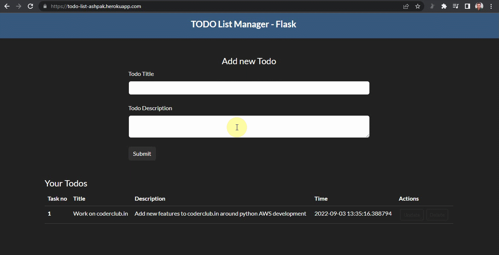

# Todo Manager with Python Flask Heroku

Basic CRUD implimentation using python flask around Todo list manager and deployed on Heroku cloud.


Deployed link : https://todo-list-ashpak.herokuapp.com/


## Tech Stack

**Client:** Python, Flask, gunicorn, Jinja2, SQLAlchemy

**Server:** Heroku


## Run Locally

Clone the project

```bash
  git clone https://github.com/AshpakMulani/python_projects
```

Go to the project directory

```bash
  cd todo_list
```

Create virtual environment and activate it

```bash
  virtualenv venv
  ./venv/scripts/activate
```

Install dependencies

```bash
  pip install -r requirements.txt
```

Start the server

```bash
  python app.py
```


## Demo




## Support

For support, email ashpaklmulani@gmail.com or leave your feedback on https://coderclub.in/


